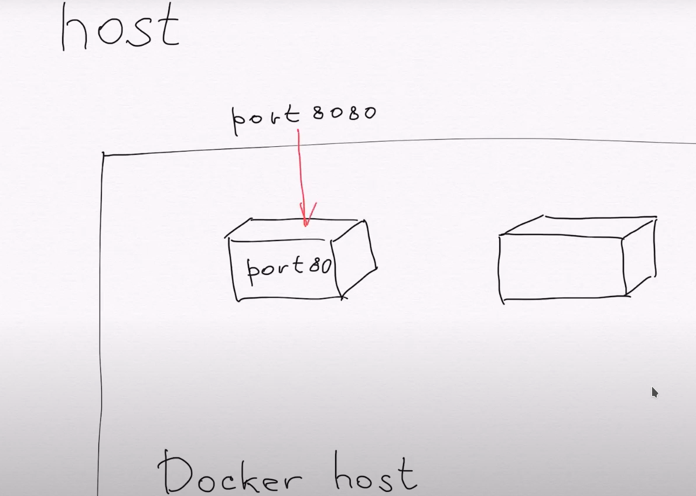
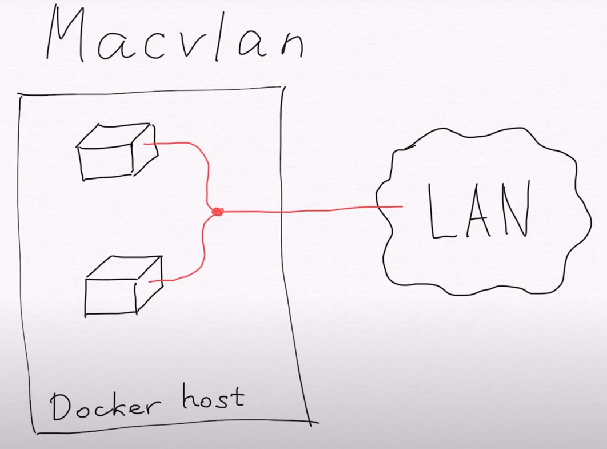
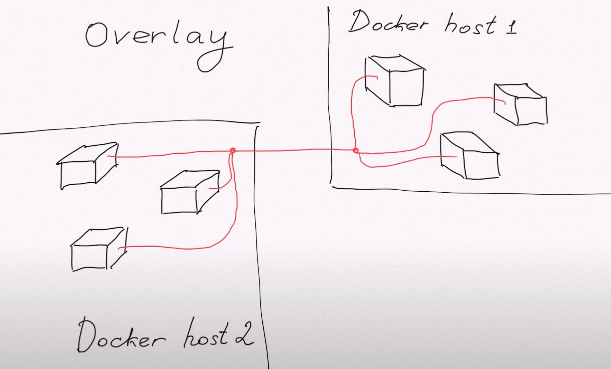
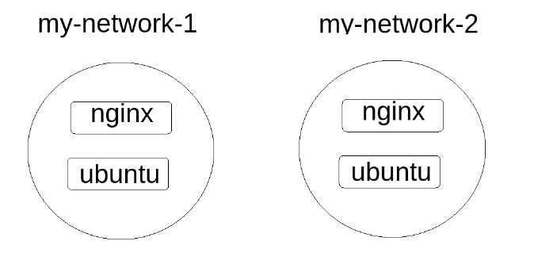
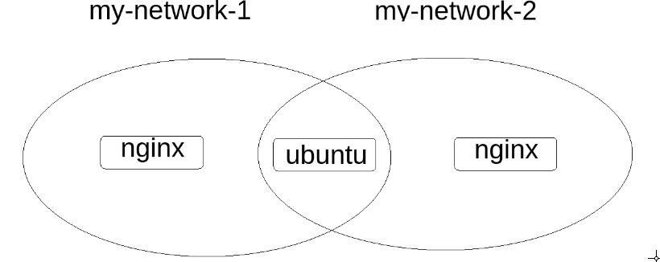
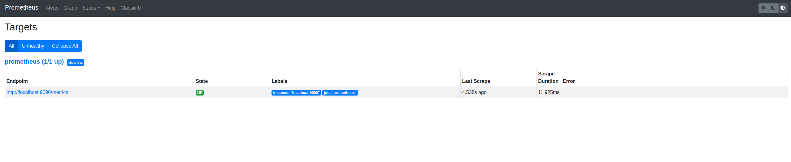
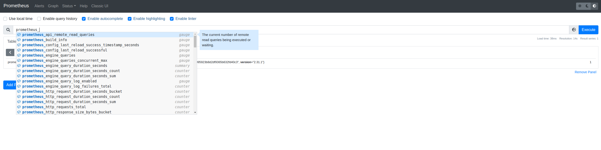
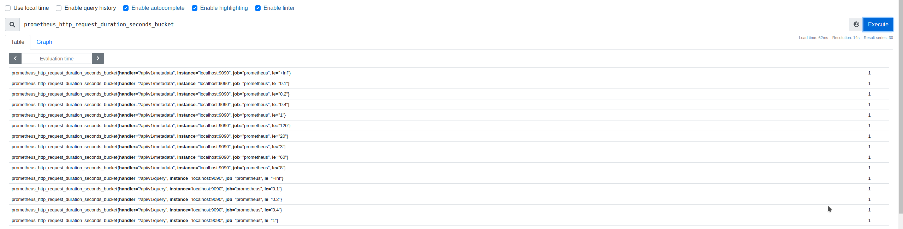

# Лабораторная работа №4
## Сети в docker (введение)


В данной лабораторной работе вы научитесь работать с сетевыми настройками docker контейнеров, а также, научитесь объединять приложения из разных контейнеров в общую подсеть (для их взамодействия).

Если после прочтения останутся вопросы обратитесь к официальному мануалу:
- https://docs.docker.com/network/
- https://docs.docker.com/compose/networking/

Также, вы можете обратиться к неофициацльнам мануалу:
- https://github.com/docker/labs/tree/master/networking/concepts

Или посмотреть видео объяснениями и примерами:
- https://www.youtube.com/watch?v=SF2oub6C6kc

---
## Виды сетей в docker

Сеть Docker построена на Container Network Model (CNM), которая позволяет кому угодно создать свой собственный сетевой драйвер. Таким образом, у контейнеров есть доступ к разным типам сетей и они могут подключаться к нескольким сетям одновременно. Помимо различных сторонних сетевых драйверов, у самого Docker-а есть несколько встроенных:

- **Bridge** - по сути, это некая подсеть, внутри которой будут работать группы контейнеров. Данная подсеть не будет связана с другой такой же подсетью (с другой группой контейнеров). Необходимо понимать, что таких подсетей можно сделать несколько, но по-умолчанию одна такая сеть уже существует (создается при установке и запуске docker демона). Таким образом, если в docker не будет указана новая подсеть, в которой нужно запустить приложения, все контейнеры, указанные в docker, будут подключены к подсети по-умолчанию. В docker-compose работает иначе, контейнеры не подключаются к сети по-умолчанию, для этого создается отдельная подсеть (будет рассмотрено в примерах ниже).

  

- **Host** - этот драйвер позволяет запускать приложения во внутренней сети хоста (машины, на которой запущен docker). Представьте, что вы просто запускаете приложение, которое находится не в docker, а на самом хосте (например, приложение nginx). Данное приложение может взаимодействовать по сети с другими приложениями хоста. Таким же образом будет взаимодействовать приложение обернутое в docker, если указать ему сетевой драйвер **host**. Также, необходимо указать проброс порта, для взаимодействия.

  

- **Macvlan** - это старый драйвер, который практически никто не использует. Он позволяет подключаться при помощи виртуального интерфейса к физическому (LAN). При этом у каждого контейнера будет свой MAC-адрес.

  

- **Overlay** - этот драйвер позволяет создавать docker подсеть между несколькими хостами (компьютерами). Данный драйвер обычно не устанавливается вместе с docker, его использует docker swarm (это приложение, позволяющее работать над docker, является оркестратором docker).

  

- **none** - означает, что контейнер не использует сеть.

## Практическая часть (Bridge)

Перед работой выполните команды (не забывайте, что у вас запуск команды `docker` может быть через `sudo`: `sudo docker ...`):

```bash
$ # Остановка всех контейнеров
$ docker kill $(docker ps -a -q)
$ # Удаление всех контейнеров
$ docker rm $(docker ps -a -q)
$ # Удаление всех неиспользуемых сущностей (используемых в docker)
$ # Данная команда также удаляет неиспользуемые сети
$ docker system prune -a
```

Перед работой проверим, какие сети уже присутствуют в `docker`:
```bash
$ docker network ls
NETWORK ID     NAME      DRIVER    SCOPE
b9812edf3710   bridge    bridge    local
0465846c8c07   host      host      local
336a2481721a   none      null      local
```

Из вывода команды видим, что имеется 3 сети, созданные по-умолчанию.
Проверим настройки сети с названием `bridge`:

```bash
$ docker network inspect bridge
[
    {
        "Name": "bridge",
        "Id": "b9812edf3710ff367e5e428e1da18df551b34e9402dfa542ee3e5fe6d6705ba7",
        "Created": "2021-11-13T19:14:37.332090578+03:00",
        "Scope": "local",
        "Driver": "bridge",
        "EnableIPv6": false,
        "IPAM": {
            "Driver": "default",
            "Options": null,
            "Config": [
                {
                    "Subnet": "172.17.0.0/16",
                    "Gateway": "172.17.0.1"
                }
            ]
        },
        "Internal": false,
        "Attachable": false,
        "Ingress": false,
        "ConfigFrom": {
            "Network": ""
        },
        "ConfigOnly": false,
        "Containers": {},
        "Options": {
            "com.docker.network.bridge.default_bridge": "true",
            "com.docker.network.bridge.enable_icc": "true",
            "com.docker.network.bridge.enable_ip_masquerade": "true",
            "com.docker.network.bridge.host_binding_ipv4": "0.0.0.0",
            "com.docker.network.bridge.name": "docker0",
            "com.docker.network.driver.mtu": "1500"
        },
        "Labels": {}
    }
]
```

Из настроек сети `bridge` видим, что для нее используется драйвер `bridge`, а также, что у сети есть пул адресов: `172.17.0.0/16` и шлюз `172.17.0.1`.

По сути, если контейнер подключится к сети `bridge`, ему выделится некий адрес из указанного пула `172.17.0.0/16`, к которому можно будет обращаться из этой же сети. Для обращения во вне, будет использоваться шлюз `172.17.0.1` (например, если запустить скачивание через `apt-get install` внутри контейнера, то тот получит данные из сети через шлюз `172.17.0.1`).

Попробуем запустить контейнер, и проверим, что с ним произойдет:

```bash
$ docker run --rm -d --name ubuntu ubuntu:latest sleep 10000
# run - запуск контейнера
# --rm - удаление контейнера, после его отработки
# -d - запуск в фоне (в виде демона)
# --name ubuntu - добавим название контенйра `ubuntu`
# ubuntu:latest - образ, который будем использовать
# sleep 10000 - команда, котора будет крутиться внутри контейнера

$ docker ps -a
CONTAINER ID   IMAGE           COMMAND         CREATED         STATUS         PORTS     NAMES
2b6ce297191f   ubuntu:latest   "sleep 10000"   2 minutes ago   Up 2 minutes             ubuntu
```

Контейнер запущен, и он будет работать, пока не закончится время в команде sleep.

Проверим сетевые настройки, что же произошло после запуска контейнера:

```bash
$ docker network list
NETWORK ID     NAME      DRIVER    SCOPE
b9812edf3710   bridge    bridge    local
0465846c8c07   host      host      local
336a2481721a   none      null      local
```

Как видим, новых сетей не появилось, проверим текущий статус в сети `bridge`:

```bash
$ docker network inspect bridge 
[
    {
        "Name": "bridge",
        "Id": "b9812edf3710ff367e5e428e1da18df551b34e9402dfa542ee3e5fe6d6705ba7",
        "Created": "2021-11-13T19:14:37.332090578+03:00",
        "Scope": "local",
        "Driver": "bridge",
        "EnableIPv6": false,
        "IPAM": {
            "Driver": "default",
            "Options": null,
            "Config": [
                {
                    "Subnet": "172.17.0.0/16",
                    "Gateway": "172.17.0.1"
                }
            ]
        },
        "Internal": false,
        "Attachable": false,
        "Ingress": false,
        "ConfigFrom": {
            "Network": ""
        },
        "ConfigOnly": false,
        "Containers": {
            "2b6ce297191f23f25a14bbde180c6843d3cf4d39d97d4932c48d9130215934fa": {
                "Name": "ubuntu",
                "EndpointID": "d39623ce4a06dcf9445e5354c7582af708d6281de509cc137a3808cbf16b1946",
                "MacAddress": "02:42:ac:11:00:02",
                "IPv4Address": "172.17.0.2/16",
                "IPv6Address": ""
            }
        },
        "Options": {
            "com.docker.network.bridge.default_bridge": "true",
            "com.docker.network.bridge.enable_icc": "true",
            "com.docker.network.bridge.enable_ip_masquerade": "true",
            "com.docker.network.bridge.host_binding_ipv4": "0.0.0.0",
            "com.docker.network.bridge.name": "docker0",
            "com.docker.network.driver.mtu": "1500"
        },
        "Labels": {}
    }
]
```

Как видно, при запуске контейнера, тот подключился к сети `bridge`.
Из сети `bridge` контейнеру был выделен ip адрес: `172.17.0.2/16`.

Проверим сам контейнер:

```bash
$ docker container inspect ubuntu

...
...
...
        "NetworkSettings": {
            "Bridge": "",
            "SandboxID": "31e1e96f7a68e7b357521b566cfc3def9bd11b2285cf1036b33009b2233a92cb",
            "HairpinMode": false,
            "LinkLocalIPv6Address": "",
            "LinkLocalIPv6PrefixLen": 0,
            "Ports": {},
            "SandboxKey": "/var/run/docker/netns/31e1e96f7a68",
            "SecondaryIPAddresses": null,
            "SecondaryIPv6Addresses": null,
            "EndpointID": "89a635a6c68551358ed673e82ddaed2a6fc88b22af14fe590f28ac6057a259c9",
            "Gateway": "172.17.0.1",
            "GlobalIPv6Address": "",
            "GlobalIPv6PrefixLen": 0,
            "IPAddress": "172.17.0.2",
            "IPPrefixLen": 16,
            "IPv6Gateway": "",
            "MacAddress": "02:42:ac:11:00:02",
            "Networks": {
                "bridge": {
                    "IPAMConfig": null,
                    "Links": null,
                    "Aliases": null,
                    "NetworkID": "b9812edf3710ff367e5e428e1da18df551b34e9402dfa542ee3e5fe6d6705ba7",
                    "EndpointID": "89a635a6c68551358ed673e82ddaed2a6fc88b22af14fe590f28ac6057a259c9",
                    "Gateway": "172.17.0.1",
                    "IPAddress": "172.17.0.2",
                    "IPPrefixLen": 16,
                    "IPv6Gateway": "",
                    "GlobalIPv6Address": "",
                    "GlobalIPv6PrefixLen": 0,
                    "MacAddress": "02:42:ac:11:00:02",
                    "DriverOpts": null
                }
            }
        }
    }
]
```

В сетевых настройках контейнера мы видим тоже самое.

Проверим сетевые настройки, при использовании docker-compose.

Удалим контейнер:
```bash
docker kill ubuntu
```

Создадим пустую папку `test`:
```bash
$ mkdir test
$ cd test
```

Создадим `docker-compose.yaml` файл со следующим содержимым:

```yaml
version : "3"

services:
  ubuntu_service:
    container_name: ubuntu_container_name
    image: ubuntu:latest
    restart: always
    command: sleep 10000
```

Запустим контейнер:

```bash
$ docker-compose up -d
```

Проверим текущее состояние подсетей:

```bash
$ docker network ls
NETWORK ID     NAME           DRIVER    SCOPE
b9812edf3710   bridge         bridge    local
0465846c8c07   host           host      local
336a2481721a   none           null      local
64ce1c4d0846   test_default   bridge    local
```

Видим, что создалась сеть `test_default`, использующая драйвер `bridge`. Название сети состоит из названия дирректории (`test`) +суффикс (`default`). Данное имя - это имя проекта, и данное название генерируется по-умолчанию (его можно изменить, но мы не будем заострять на этом внимание).

Проверим настройки сети:

```bash
$ docker network inspect test_default
[
    {
        "Name": "test_default",
        "Id": "96cd1a6e1001e9a579414f321ff1e13d20bd257349fef447135830384946b900",
        "Created": "2021-11-13T22:03:56.674321135+03:00",
        "Scope": "local",
        "Driver": "bridge",
        "EnableIPv6": false,
        "IPAM": {
            "Driver": "default",
            "Options": null,
            "Config": [
                {
                    "Subnet": "172.21.0.0/16",
                    "Gateway": "172.21.0.1"
                }
            ]
        },
        "Internal": false,
        "Attachable": true,
        "Ingress": false,
        "ConfigFrom": {
            "Network": ""
        },
        "ConfigOnly": false,
        "Containers": {
            "5d3edafba8c223ac0f7494be699ccd46e7e3242dc2cbe337e5009709e20ff4ff": {
                "Name": "ubuntu_container_name",
                "EndpointID": "6c3004a77b3a35b882aab7928b28f7a9ad822290cc988481505987a40b59adea",
                "MacAddress": "02:42:ac:15:00:02",
                "IPv4Address": "172.21.0.2/16",
                "IPv6Address": ""
            }
        },
        "Options": {},
        "Labels": {
            "com.docker.compose.network": "default",
            "com.docker.compose.project": "test",
            "com.docker.compose.version": "1.28.4"
        }
    }
]
```

На самом деле, мы видим абсолютно схожую картину, как и в первом случае, только здесь была создана подсеть, а не переиспользовалась подсеть по-умолчанию. Новая сеть имеет пул `172.21.0.0/16` и шлюз `172.21.0.1`, и к ней подключился контейнер с названием `ubuntu_container_name`, и данный контейне получил адрес из пула `172.21.0.2/16`.

Проверим сетевые настройки самого контейнера:

```bash
$ docker container inspect ubuntu_container_name

...
...
...
        "NetworkSettings": {
            "Bridge": "",
            "SandboxID": "008a228a1cfd779a8410b2d5787bd0a504372a187233e6668ac321da125f70fe",
            "HairpinMode": false,
            "LinkLocalIPv6Address": "",
            "LinkLocalIPv6PrefixLen": 0,
            "Ports": {},
            "SandboxKey": "/var/run/docker/netns/008a228a1cfd",
            "SecondaryIPAddresses": null,
            "SecondaryIPv6Addresses": null,
            "EndpointID": "",
            "Gateway": "",
            "GlobalIPv6Address": "",
            "GlobalIPv6PrefixLen": 0,
            "IPAddress": "",
            "IPPrefixLen": 0,
            "IPv6Gateway": "",
            "MacAddress": "",
            "Networks": {
                "test_default": {
                    "IPAMConfig": null,
                    "Links": null,
                    "Aliases": [
                        "5d3edafba8c2",
                        "ubuntu_service"
                    ],
                    "NetworkID": "96cd1a6e1001e9a579414f321ff1e13d20bd257349fef447135830384946b900",
                    "EndpointID": "6c3004a77b3a35b882aab7928b28f7a9ad822290cc988481505987a40b59adea",
                    "Gateway": "172.21.0.1",
                    "IPAddress": "172.21.0.2",
                    "IPPrefixLen": 16,
                    "IPv6Gateway": "",
                    "GlobalIPv6Address": "",
                    "GlobalIPv6PrefixLen": 0,
                    "MacAddress": "02:42:ac:15:00:02",
                    "DriverOpts": null
                }
            }
        }
    }
]
```

Здесь мы видим тоже схожую картину, за исключением одной детали:

```yaml
"Aliases": [
    "5d3edafba8c2",
    "ubuntu_service"
]
```

Данный `Aliases` - это некий домен, по этому алясу можно обратиться к контейнеру из сети `test_default`. На самом деле, в `docker` не работают на прямую с адресами (тк адреса контейнерам выдаются рандомно, их нельзя предугадать), поэтому в `docker-compose` автоматически добавляется некий аляс (ссылка) на адрес. Данная ссылка имеет название сервиса, который мы указали в `docker-compose.yaml`, и второе название `5d3edafba8c2` - id контейнера (сервиса).
Данную ссылку можно переопредели, если в этом есть необходимость.

Используем другой образ (с web интерфейсом), чтобы проверить работу таких алясов.

Опустим текущий контейнер:

```bash
docker-compose down
```

Изменим содаржимое `docker-compose.yaml` файла (запустим другое приложение - web сервис nginx):

```yaml
version : "3"

services:

  ubuntu_service:
    container_name: ubuntu_container_name
    image: ubuntu:latest
    restart: always
    command: sleep 10000

  # Добавим новое приложение - `nginx`
  # приложение по-умолчанию прослушивает адрес:
  # 0.0.0.0:80 внутри контейнера
  nginx_service:
    container_name: nginx_container_name
    image: nginx
    restart: always
```

Проверим сеть:

```bash
$ docker network inspect test_default
[
    {
        "Name": "test_default",
        "Id": "c5bed32deda95aa81fbba612bb37205d384247f8fd89145a777ea5143fea39d2",
        "Created": "2021-11-14T18:27:08.021459016+03:00",
        "Scope": "local",
        "Driver": "bridge",
        "EnableIPv6": false,
        "IPAM": {
            "Driver": "default",
            "Options": null,
            "Config": [
                {
                    "Subnet": "172.19.0.0/16",
                    "Gateway": "172.19.0.1"
                }
            ]
        },
        "Internal": false,
        "Attachable": true,
        "Ingress": false,
        "ConfigFrom": {
            "Network": ""
        },
        "ConfigOnly": false,
        "Containers": {
            "75427c3cb95920acf18ff1da370e1cff4cc8f321f420a01bc1e34e21bee1057e": {
                "Name": "nginx_container_name",
                "EndpointID": "198b06f3c741394570cbcf7dbf67929e77dc0d20b82b8652ff588270fc5d5190",
                "MacAddress": "02:42:ac:13:00:02",
                "IPv4Address": "172.19.0.2/16",
                "IPv6Address": ""
            },
            "96147032b3350e3c65370f93549758b0cd91462bfccb4fbcb29a8c0bc0355206": {
                "Name": "ubuntu_container_name",
                "EndpointID": "539bb49cd8236692894a07acad2a6d6e0a80c4de61b41f7f41f40ad1cbdffb9a",
                "MacAddress": "02:42:ac:13:00:03",
                "IPv4Address": "172.19.0.3/16",
                "IPv6Address": ""
            }
        },
        "Options": {},
        "Labels": {
            "com.docker.compose.network": "default",
            "com.docker.compose.project": "test",
            "com.docker.compose.version": "1.28.4"
        }
    }
]

$ docker container inspect nginx_container_name
...
...
...
        "NetworkSettings": {
            "Bridge": "",
            "SandboxID": "d24ccaa73f7433ed916c1a9ee5df6fdae65ae184a42013da0cbb80c450a36466",
            "HairpinMode": false,
            "LinkLocalIPv6Address": "",
            "LinkLocalIPv6PrefixLen": 0,
            "Ports": {
                "80/tcp": null
            },
            "SandboxKey": "/var/run/docker/netns/d24ccaa73f74",
            "SecondaryIPAddresses": null,
            "SecondaryIPv6Addresses": null,
            "EndpointID": "",
            "Gateway": "",
            "GlobalIPv6Address": "",
            "GlobalIPv6PrefixLen": 0,
            "IPAddress": "",
            "IPPrefixLen": 0,
            "IPv6Gateway": "",
            "MacAddress": "",
            "Networks": {
                "test_default": {
                    "IPAMConfig": null,
                    "Links": null,
                    "Aliases": [
                        "nginx_service",
                        "75427c3cb959"
                    ],
                    "NetworkID": "c5bed32deda95aa81fbba612bb37205d384247f8fd89145a777ea5143fea39d2",
                    "EndpointID": "198b06f3c741394570cbcf7dbf67929e77dc0d20b82b8652ff588270fc5d5190",
                    "Gateway": "172.19.0.1",
                    "IPAddress": "172.19.0.2",
                    "IPPrefixLen": 16,
                    "IPv6Gateway": "",
                    "GlobalIPv6Address": "",
                    "GlobalIPv6PrefixLen": 0,
                    "MacAddress": "02:42:ac:13:00:02",
                    "DriverOpts": null
                }
            }
        }
    }
]
```

Видим, что контейнеры запустились в одной подсети. Контейнеры получили адреса (у вас могут отличаться):

-   ubuntu - `172.19.0.3/16`;
-   nginx - `172.19.0.2/16`.

А также, видим, что nginx получил следующие алясы (у ubuntu тоже будут свои алясы, но мы рассмотрим один пример с nginx):

```yaml
"Aliases": [
    "nginx_service",
    "75427c3cb959"
]
```

Мы заранее знаем, что nginx у себя внутри прослушивает адрес `0.0.0.0` по порту 80, а значит, что он прослушивает все адреса внутри себя, а значит и и адрес `172.19.0.2/16` (его же адрес) тоже прослушивается на этом же порту. Следовательно, при обращении к адресу `172.19.0.2/16` по порту 80, мы получим ответ от приложение, а так как адрес `172.19.0.2/16` имеет аляс (некий домен), то, значит и по алясу, по порту 80 мы получим ответ.


> Для пояснения адреса 0.0.0.0, расмотрим пример. Представьте, что у вас есть дома роутер (dhcp сервр), он создает общую сеть, и вы можете к этой сети подключиться с помощью компьютера (при подключении вам выдастся рандомный ip адрес). В итоге, на вашей локально машине будет адрес localhost (127.0.0.1) и адрес, выданный dhcp сервером (пусть будет адрес `A`). Пусть у вас имеется задача, запустить у себя локально на компьютере приложение, которое бы работала на порту `8080` (взял как пример, порт может быть любой), на которое можно будет зайти по выданному адресу `A` (то есть, зная ваш адрес `A`, компьютер из тоже же сети должен иметь доступ к приложению на вашемм ПК). Для того, чтобы другие компьютеры в вашей сети могли получить доступ к приложению, которе находится у вас, вы должны запустить его у себя локально на адресе 0.0.0.0 (порт 8080). Тогда, приложение будет прослушивать все адреса (а именно, тот адрес, который вы получили от dhcp серерва и ваш localhost.
Данная аналогия работает также и для docker. У вас есть подсеть (`bridge`), в которой разворачиваются несколько контейнеров. Каждому контейнеру выдается рандомный адрес, + у каждого контейнера (как у отдельного ПК) есть локальный адрес localhost. Поэтому, чтобы другой контейнер мог получить доступ к приложению из другого конйтенра, приложение должно быть запщено на адресе 0.0.0.0.

Проверим, зайдем внутрь контейнера `ubuntu` и выполним curl запрос в приложение `nginx`:

```bash
$ docker exec -it ubuntu_container_name bash
  # Вы попадете во внутреннюю консоль контейнера ubuntu
  # в контейнере не предустановлен curl, выполните команды:
$ apt update && apt-get install curl -y
  # выполните curl запрос по алясу:
$ curl nginx_service:80
<!DOCTYPE html>
<html>
<head>
<title>Welcome to nginx!</title>
<style>
html { color-scheme: light dark; }
body { width: 35em; margin: 0 auto;
font-family: Tahoma, Verdana, Arial, sans-serif; }
</style>
</head>
<body>
<h1>Welcome to nginx!</h1>
<p>If you see this page, the nginx web server is successfully installed and
working. Further configuration is required.</p>

<p>For online documentation and support please refer to
<a href="http://nginx.org/">nginx.org</a>.<br/>
Commercial support is available at
<a href="http://nginx.com/">nginx.com</a>.</p>

<p><em>Thank you for using nginx.</em></p>
</body>
</html>

  # выполните curl запрос по ip адресу:
$ curl 172.19.0.2:80
<!DOCTYPE html>
<html>
<head>
<title>Welcome to nginx!</title>
<style>
html { color-scheme: light dark; }
body { width: 35em; margin: 0 auto;
font-family: Tahoma, Verdana, Arial, sans-serif; }
</style>
</head>
<body>
<h1>Welcome to nginx!</h1>
<p>If you see this page, the nginx web server is successfully installed and
working. Further configuration is required.</p>

<p>For online documentation and support please refer to
<a href="http://nginx.org/">nginx.org</a>.<br/>
Commercial support is available at
<a href="http://nginx.com/">nginx.com</a>.</p>

<p><em>Thank you for using nginx.</em></p>
</body>
</html>
```


Попробуем сделать следующее, попробуем создать свою подсеть со совоим именем, а также, попробуем переопределить алясы (домены):

Выполним остановку контейнеров:
```bash
docker-compose down
```

Обновим `docker-compose.yaml` файл:

```yaml
version : "3"

services:

  ubuntu_service:
    container_name: ubuntu_container_name
    image: ubuntu:latest
    restart: always
    command: sleep 10000
    networks:
      - my-network

  nginx_service:
    container_name: nginx_container_name
    image: nginx
    restart: always
    # Данная запись имеет тоже значение, что и запись:
    # networks:
    #  - my-network
    # только здесь мы можем добавлять доп параметры
    # в сетевые настройки над контейнером внутри скобок: {}
    networks:
      my-network: {}

# Появился новый тип записи (не services, а networks)
# Данная запись указывает какие сети необходимо создать/использовать в текущем манифесте
# Также, для применения сетей, необходимо указать настройки в контейнерах
networks:
  my-network:
    name: my-network
```

Запустим новый `docker-compose.yaml` файл и проверим сетевые настройки
```bash
$ docker-compose up -d

$ docker network ls
NETWORK ID     NAME         DRIVER    SCOPE
bcecac84db9a   bridge       bridge    local
0465846c8c07   host         host      local
0ed17f2da643   my-network   bridge    local
336a2481721a   none         null      local
```

Видим, что теперь появилась другая сеть с названием `my-network` (сетеовй драйвер - `bridge`, он всегда идет по-умолчанию).

Алясы мы не правили, поэтому сетевые настройки будут идентичны предыдущему случаю.


Опустим контейнер:

```bash
$ docker-compose down
```

Изменим `docker-compose.yaml` файл:

```bash
version : "3"

services:

  ubuntu_service:
    container_name: ubuntu_container_name
    image: ubuntu:latest
    restart: always
    command: sleep 10000
    networks:
      - my-network

  nginx_service:
    container_name: nginx_container_name
    image: nginx
    restart: always
    networks:
      my-network:
      # Переопределение alias внутри сети `my-network`
      # для nginx
        aliases:
         - new_alias_for_nginx


networks:
  my-network:
    name: my-network
```


Запустим контейнеры и проверим алясы для контейнера nginx:

```bash
$ docker-compose up -d

$ docker container inspect nginx_container_name
...
...
...
        "NetworkSettings": {
            "Bridge": "",
            "SandboxID": "8b26fa99fbed5d8f3e49fa77c1e0d211911826c2558db01b30676876a1da2844",
            "HairpinMode": false,
            "LinkLocalIPv6Address": "",
            "LinkLocalIPv6PrefixLen": 0,
            "Ports": {
                "80/tcp": null
            },
            "SandboxKey": "/var/run/docker/netns/8b26fa99fbed",
            "SecondaryIPAddresses": null,
            "SecondaryIPv6Addresses": null,
            "EndpointID": "",
            "Gateway": "",
            "GlobalIPv6Address": "",
            "GlobalIPv6PrefixLen": 0,
            "IPAddress": "",
            "IPPrefixLen": 0,
            "IPv6Gateway": "",
            "MacAddress": "",
            "Networks": {
                "my-network": {
                    "IPAMConfig": null,
                    "Links": null,
                    "Aliases": [
                        "new_alias_for_nginx",
                        "nginx_service",
                        "4e154dc3ca6b"
                    ],
                    "NetworkID": "8b01b55e252c9c9684893fd87ddbc142cb2c1b535f4995adca95ae737ae146c0",
                    "EndpointID": "dc79db6cf486f870b1a5c21d63d233d940ed150009f72335a3197273224202b7",
                    "Gateway": "172.21.0.1",
                    "IPAddress": "172.21.0.3",
                    "IPPrefixLen": 16,
                    "IPv6Gateway": "",
                    "GlobalIPv6Address": "",
                    "GlobalIPv6PrefixLen": 0,
                    "MacAddress": "02:42:ac:15:00:03",
                    "DriverOpts": null
                }
            }
        }
    }
]
```

Видим, что добавленный аляс сработал:

```yaml
"Aliases": [
    "new_alias_for_nginx",
    "nginx_service",
    "4e154dc3ca6b"
]
```

Помимо алясов по-умолчанию, добавился аляс `new_alias_for_nginx`.

Мы можем также проверить curl запрос по данному алясу:

```bash
$ docker exec -it ubuntu_container_name bash
  # Вы попадете во внутреннюю консоль контейнера ubuntu
  # в контейнере не предустановлен curl, выполните команды:
$ apt update && apt-get install curl -y
  # выполните curl запрос по алясу:
$ curl new_alias_for_nginx:80
<!DOCTYPE html>
<html>
<head>
<title>Welcome to nginx!</title>
<style>
html { color-scheme: light dark; }
body { width: 35em; margin: 0 auto;
font-family: Tahoma, Verdana, Arial, sans-serif; }
</style>
</head>
<body>
<h1>Welcome to nginx!</h1>
<p>If you see this page, the nginx web server is successfully installed and
working. Further configuration is required.</p>

<p>For online documentation and support please refer to
<a href="http://nginx.org/">nginx.org</a>.<br/>
Commercial support is available at
<a href="http://nginx.com/">nginx.com</a>.</p>

<p><em>Thank you for using nginx.</em></p>
</body>
</html>


Рассмотрим пример поинтереснее, создами 2 пары приложени ubuntu и nginx и пометим их в разные подсети. Попробуем обратиться также с помощью curl запроса в разные подсети:

Остановим контейнеры:
```bash
$ docker-compose down
```

Изменим `docker-compose.yaml` файл:

```yaml
version : "3"

services:

  # Первая группа контейнеров (находится в первой сети)
  ubuntu_service_1:
    container_name: ubuntu_container_name_1
    image: ubuntu:latest
    restart: always
    command: sleep 10000
    networks:
      - my-network-1

  nginx_service_1:
    container_name: nginx_container_name_1
    image: nginx
    restart: always
    networks:
      my-network-1:
        aliases:
         - new_alias_for_nginx_1

  # Вторая группа контейнеров (находится во второй сети)
  ubuntu_service_2:
    container_name: ubuntu_container_name_2
    image: ubuntu:latest
    restart: always
    command: sleep 10000
    networks:
      - my-network-2

  nginx_service_2:
    container_name: nginx_container_name_2
    image: nginx
    restart: always
    networks:
      my-network-2:
        aliases:
         - new_alias_for_nginx_2


networks:
  my-network-1:
    name: my-network-1
  my-network-2:
    name: my-network-2
```


Запустим и проверим сети:

```bash
$ docker-compose up -d

$ docker network ls
NETWORK ID     NAME           DRIVER    SCOPE
bcecac84db9a   bridge         bridge    local
0465846c8c07   host           host      local
d3581de1fa56   my-network-1   bridge    local
d61cbaa308a0   my-network-2   bridge    local
336a2481721a   none           null      local
```

Видим, что теперь создались 2 подсети: `my-network-1`, `my-network-1`.

Проверим, что находится внутри них:

```bash
$ docker network inspect my-network-1
...
...
...
        "Containers": {
            "911c366a8e046f6ff14035cffb35cc1c604f035107cbc370f487a2e1f0df2c74": {
                "Name": "nginx_container_name_1",
                "EndpointID": "1d30c864fde55b45d95118102acc569e3dca43c81babfda54887776473ca0ad2",
                "MacAddress": "02:42:ac:16:00:02",
                "IPv4Address": "172.22.0.2/16",
                "IPv6Address": ""
            },
            "ace50a9030f1fb38829e51e33e7bb1ae25a9895e43c9f8d003b08834d3a099ce": {
                "Name": "ubuntu_container_name_1",
                "EndpointID": "13711fef280c95325274c13808c755f744093a4b670678055233ae926860b086",
                "MacAddress": "02:42:ac:16:00:03",
                "IPv4Address": "172.22.0.3/16",
                "IPv6Address": ""
            }
        },
...
...
...
```

Как видим, в сети `my-network-1` имеются контейнеры:

-   `nginx_container_name_1`;
-   `ubuntu_container_name_1`.

Аналогично будет и в сети `my-network-2`.


Попробуем зайти в контейнер `ubuntu_container_name_1` и проверить доступность обоих сервисов nginx:

```bash
$ docker exec -it ubuntu_container_name_1 bash
  # Вы попадете во внутреннюю консоль контейнера ubuntu
  # в контейнере не предустановлен curl, выполните команды:
$ apt update && apt-get install curl -y
  # curl запрос к nginx, находящимуся в тойже подсети
$ curl new_alias_for_nginx_1:80
<!DOCTYPE html>
<html>
<head>
<title>Welcome to nginx!</title>
<style>
html { color-scheme: light dark; }
body { width: 35em; margin: 0 auto;
font-family: Tahoma, Verdana, Arial, sans-serif; }
</style>
</head>
<body>
<h1>Welcome to nginx!</h1>
<p>If you see this page, the nginx web server is successfully installed and
working. Further configuration is required.</p>

<p>For online documentation and support please refer to
<a href="http://nginx.org/">nginx.org</a>.<br/>
Commercial support is available at
<a href="http://nginx.com/">nginx.com</a>.</p>

<p><em>Thank you for using nginx.</em></p>
</body>
</html>


  # curl запрос к nginx, находящимуся в другой подсети
$ curl new_alias_for_nginx_2:80
curl: (6) Could not resolve host: new_alias_for_nginx_2
```

Как мы видим, запрос прошел только к nginx, находящемуся в тойже подсети, что и контейнер ubuntu. Это правильно, так как данные сети никак не пересекаются:



Попробуем это исправить, создадим один экземпляр ubuntu, который будет находиться в двух разных сетях и будет иметь возможность взаимодействовать с двумя экземплярами nginx:



Остановим контейнеры:
```bash
$ docker-compose down
```

Испрваим `docker-compose.yaml`:

```yaml
version : "3"

services:

  # ubuntu_service, находящийся в обоих подсетях
  ubuntu_service:
    container_name: ubuntu_container_name
    image: ubuntu:latest
    restart: always
    command: sleep 10000
    networks:
      - my-network-1
      - my-network-2

  # Первый экземпляр nxin, находящийся в первой подсети
  nginx_service_1:
    container_name: nginx_container_name_1
    image: nginx
    restart: always
    networks:
      my-network-1:
        aliases:
         - new_alias_for_nginx_1

  # Второй экземпляр nxin, находящийся во второй подсети
  nginx_service_2:
    container_name: nginx_container_name_2
    image: nginx
    restart: always
    networks:
      my-network-2:
        aliases:
         - new_alias_for_nginx_2

networks:
  my-network-1:
    name: my-network-1
  my-network-2:
    name: my-network-2
```


Запустим и проверим выполнение curl запроса к обоим nxin (вы можете сами проверить сетевые настройки, чтобы убедиться, что ubuntu находится в обоих подсетях):

```bash
$ docker-compose up -d

$ docker exec -it ubuntu_container_name bash
  # Вы попадете во внутреннюю консоль контейнера ubuntu
  # в контейнере не предустановлен curl, выполните команды:
$ apt update && apt-get install curl -y
  # curl запрос к первому nginx
$ curl new_alias_for_nginx_1:80
<!DOCTYPE html>
<html>
<head>
<title>Welcome to nginx!</title>
<style>
html { color-scheme: light dark; }
body { width: 35em; margin: 0 auto;
font-family: Tahoma, Verdana, Arial, sans-serif; }
</style>
</head>
<body>
<h1>Welcome to nginx!</h1>
<p>If you see this page, the nginx web server is successfully installed and
working. Further configuration is required.</p>

<p>For online documentation and support please refer to
<a href="http://nginx.org/">nginx.org</a>.<br/>
Commercial support is available at
<a href="http://nginx.com/">nginx.com</a>.</p>

<p><em>Thank you for using nginx.</em></p>
</body>
</html>


  # curl запрос ко второму nginx
$ curl new_alias_for_nginx_2:80
<!DOCTYPE html>
<html>
<head>
<title>Welcome to nginx!</title>
<style>
html { color-scheme: light dark; }
body { width: 35em; margin: 0 auto;
font-family: Tahoma, Verdana, Arial, sans-serif; }
</style>
</head>
<body>
<h1>Welcome to nginx!</h1>
<p>If you see this page, the nginx web server is successfully installed and
working. Further configuration is required.</p>

<p>For online documentation and support please refer to
<a href="http://nginx.org/">nginx.org</a>.<br/>
Commercial support is available at
<a href="http://nginx.com/">nginx.com</a>.</p>

<p><em>Thank you for using nginx.</em></p>
</body>
</html>
```

> Если сделать аналогию с домашней сетью, то в данном случае будет 2 роутера, к первому роутеру подключен первый ПК (первый nginx), ко второму - второй ПК (второй nginx). А третий ПК (ubuntu, с которого идут curl запросы) подключен к обоим роутерам (например, через кабель к первому роутеру, а через wifi - ко второму).

---
## Практическая часть (проброс портов)

> Для того, чтобы понять данную задачу, попробуем также рассмотреть некую аналогию с домашней сетью. Представим что имеется также один роутер и один ПК с неким приложением. Задача - получить доступ к приложению по ту сторону роутера.
Если рассматривать роутер, у него имеется протокол nat, который позволяет обращаться к одному кабелу (который идет к провайдеру) через другие устройства, подключенные к роутеру. Задача - пробросить порт за nat, чтобы со стороны провайдер можно было зайти на приложение. Во время проброса, приложение также должно слушать все локальные адреса внутри (localhost и ip адрес, выданный dhcp сервером, путь будет адрес `A`), поэтому, приложение должно быть запущено на адресе 0.0.0.0, чтобы к нему можно было обратиться через рандомный адрес `A`.
При пробросе порта, происходит проброс с адреса `A`:8080 (внутри ПК) -> 0.0.0.0:8080 (внутри роутера). А следовательно, так как роутер (он по сути тоже некая машина с локальными адресами и интерфейсами) имеет внещний интерфейс (с адресом `B`, идущий к провайдеру), то проброс 0.0.0.0:8080 также задевает адрес `B` на порту 8080.

> В данной аналогии роутер - это ваш ПК, контейнер - это ПК из примера (который подключался к роутеру). Адрес `B` - это адрес любого вашего интерфейса (LAN кабеля).

> Если рассматривать проброс порта из контейнера в локальную машину, то он будет выглядеть следующим образом:
проброс с localhost:8080 (внутри контейнера) -> 0.0.0.0:8080 (внутри ПК). 

> Поэтому, небольшой совет, если приложение имеет web интерфейс или адрес, к которому нужно будет обратиться, на месте адреса необходимо указать 0.0.0.0:"port" (такой адрес будет работать как для первого, так и для второго примера из текущей лабораторной работы).

Перейдем к практике. Попробуем запустить приложение nginx и пробросит его порт `80` на локальный порт нашей машины `8080`

Остановим контейнеры:
```bash
$ docker-compose down
```

Исправим `docker-compose.yaml` файл:

```yaml
version : "3"

services:

  ubuntu_service:
    container_name: ubuntu_container_name
    image: ubuntu:latest
    restart: always
    command: sleep 10000
    networks:
      - my-network

  nginx_service:
    container_name: nginx_container_name
    image: nginx
    restart: always
    ports:
      - "8080:80"
    networks:
      my-network:
        aliases:
         - new_alias_for_nginx

networks:
  my-network:
    name: my-network
```

Запустим контейнеры и проверим сетевые настройки контейнера nginx:

```bash
$ docker-compose up -d


$ docker container inspect nginx_container_name

        "NetworkSettings": {
            "Bridge": "",
            "SandboxID": "203dde3a09dcbbe1e255c63680e7d1c5ecc0502cc0c192bd25dd491396c5da5d",
            "HairpinMode": false,
            "LinkLocalIPv6Address": "",
            "LinkLocalIPv6PrefixLen": 0,
            "Ports": {
                "80/tcp": [
                    {
                        "HostIp": "0.0.0.0",
                        "HostPort": "8080"
                    },
                    {
                        "HostIp": "::",
                        "HostPort": "8080"
                    }
                ]
            },
            "SandboxKey": "/var/run/docker/netns/203dde3a09dc",
            "SecondaryIPAddresses": null,
            "SecondaryIPv6Addresses": null,
            "EndpointID": "",
            "Gateway": "",
            "GlobalIPv6Address": "",
            "GlobalIPv6PrefixLen": 0,
            "IPAddress": "",
            "IPPrefixLen": 0,
            "IPv6Gateway": "",
            "MacAddress": "",
            "Networks": {
                "my-network": {
                    "IPAMConfig": null,
                    "Links": null,
                    "Aliases": [
                        "nginx_service",
                        "new_alias_for_nginx",
                        "86ed7543b586"
                    ],
                    "NetworkID": "c148e0f00c39883b117392a408df5406ed4150cb4d926c5be6ee57e81cf6c653",
                    "EndpointID": "94473362a11ecdf0508e29615420c1a912c19ff12fb6bf38aed467d6acd271c3",
                    "Gateway": "172.26.0.1",
                    "IPAddress": "172.26.0.3",
                    "IPPrefixLen": 16,
                    "IPv6Gateway": "",
                    "GlobalIPv6Address": "",
                    "GlobalIPv6PrefixLen": 0,
                    "MacAddress": "02:42:ac:1a:00:03",
                    "DriverOpts": null
                }
            }
        }
    }
]
```

Мы не проверяли настройки самой сети, так как в ней не будет никаких изменений. Единственное изменение произойдет в сетевых настройках самого приложения:

```yaml
...
...
...
"Ports": {
    "80/tcp": [
        {
            "HostIp": "0.0.0.0",
            "HostPort": "8080"
        },
        {
            "HostIp": "::",
            "HostPort": "8080"
        }
    ]
},
...
...
...
```

Из сетевых настроек приложения, мы видим, что произошел проброс порта (данный проброс не связан с подсетью, так как мы не видим никаких параметров подсети `my-network`). Проброс выполнился на локальный адрес `0.0.0.0`:80 вашей машины (ПК). Вы можете перейти в браузер по данному адресу, чтобы убедиться в работе приложения nginx (можно также использовать адрес `localhost`, так как 0.0.0.0 шарится на все локальные адреса).

Объединение в подсеть `my-network` (из предыдущих примеров) также будут работать. Вы сможете также выполнить curl запрос из контейнера ubuntu к контейнеру nginx.

---
## Работа с сетями на примере grafana-prometheus:

Для рассмотрения примера, перейдите в директорию `grafana-prometheus`.

В данной директории имеются 3 файла:

- `docker-compose.yaml` - манифест файл для запуска docker контейнеров;
- `grafana_datasource.yaml` - конфигурационный файл для grafana;
- `prometheus.yml` - конфигурационный файл для prometheus.


```bash
$ cat docker-compose.yaml

version: '3.9'

services:
  # Название сервиса (он же аляс в сети)
  prometheus:
    # Образ для prometheus
    image: prom/prometheus:latest
    # Название контейнера
    container_name: prometheus
    # Политика перезапуска
    restart: always
    # Список используемых сетей
    networks:
      - prometheus
    # Проброс порта во вне
    ports:
      - 9090:9090
    # Передача конфигурационного файла
    volumes:
      - ./prometheus.yml:/etc/prometheus/prometheus.yml:ro
    # Переопределение команды запуска контейнера (чтобы при запуске взял переданный нами файл)
    # Также, в команде указываем адес, на котором должнен слушать primetheus
    command:
      - --config.file=/etc/prometheus/prometheus.yml
      - '--web.listen-address=0.0.0.0:9090'

  # Название сервиса (он же аляс в сети)
  grafana:
    # Образ для prometheus
    image: grafana/grafana:latest
    # Название контейнера
    container_name: grafana
    # Политика перезапуска
    restart: always
    # Переменные, который использует grafana (логин/пароль)
    environment:
      - GF_SECURITY_ADMIN_USER=admin
      - GF_SECURITY_ADMIN_PASSWORD=admin1234
      - GF_USERS_ALLOW_SIGN_UP=false
    # Список используемых сетей
    networks:
      - prometheus
    # Проброс порта во вне
    ports:
      - 8080:3000
    # Передача конфигурационного файла
    volumes:
      - ./grafana_datasource.yaml:/etc/grafana/provisioning/datasources/datasource.yaml:ro
    # Добавляем зависимость (контейнер с grafana запустится только после контейнера prometheus)
    depends_on:
      - prometheus

# Сети
networks:
  prometheus:
      name: prometheus
```


```bash
$ cat grafana_datasource.yaml

# Это внутренний конфигурационный файл grafana
# указывает источник информации (источник - prometheus)
# Домен/аляс `prometheus` взят по названию сервиса `prometheus`
apiVersion: 1

datasources:
  - name: 'Prometheus Server'
    type: prometheus
    access: proxy
    url: http://prometheus:9090/
    isDefault: true
    disableDeletion: false
    allowUiUpdates: true
    readOnly: false
    editable: true
```

```bash
$ cat prometheus.yml

# Это внутренний конфигурационный файл prometheus
# prometheus - это приложение, которое считывает метрики
# в данном случае, мы получаем метрики из самого prometheus (да, приложение само может отдавать метрики).
global:
  # Как часто считывать метрики
  scrape_interval: 5s
scrape_configs:
    # первая джоба по считыванию метрики (и ее название)
  - job_name: 'prometheus'
    # путь до метрик (путь добавиться к адресу: 'localhost:9090/metrics')
    metrics_path: /metrics
    # Адрес для прослушивания (указывается адрес самого prometheus)
    static_configs:
      - targets: ['localhost:9090']
```

Данная связка позволяет получать метрики из prometheus (метрики самого prometheus) и отображать их в grafan.

Для проверки настройки соединения, необходимо перейти в grafana по адресу http://localhost:8080/ , зайти под пользователем admin/admin1234 и зайти во вкладку [datasources](http://localhost:8080/datasources). В ней будет указан источник данных - prometheus.

Необходимо зайти в данный датасурс и проверить настройки (настройки были переданы через файл `grafana_datasource.yaml`). Перейдите в самый низ и нажмите на кнопку `save & test`. Если появится сообщение `Data source is working` - подключение grafana к prometheus было выполнено корректно.

Для проверки конфигурации prometheus, необходимо перейти по его адресу `http://localhost:9090/` в раздел [targets](http://localhost:9090/targets).

В данном разделе указаны все таргетсы, с который происходит считывание метрик (сейчас он один, это таргет самого prometheus):




Вы можете перейти в главное меню, чтобы посмотреть текущее состояние метрик. Название метрик у promteheus будут начинаться с `prometheus_*`:




---
## Задания для лабораторной работы:

1. Необходимо установить в одной сети базу данных `mongodb` и `mongodb-exporter`. `mongodb-exporter` должна считыват метрики с `mongodb` (если хотите поработать с другим приложение, не с `mongo`, можете использовать любое другое приложение, поддерживающее сбор метрик https://prometheus.io/docs/instrumenting/exporters/). 

   Результат выполнения:
    - через web интерфейс `mongodb-exporter` можно увидеть метрики базы `mongodb`.

2. Подключить `mongodb` и `mongodb-exporter` к связке `promehteus-grafana`:
   Необходимо, чтобы:
   -  `mongodb` и `mongodb-exporter` находились в одной сети (сеть `mongodb`);
   -  `mongodb-exporter`, `promehteus`, `grafana` находились во второй сети (сеть `prometheus`);

   Подсказка:
   -  Для подключение `mongodb-exporter` к `prometheus`, необходимо указать похожий конфиг:

   ```bash
    - job_name: 'mongodb'
      metrics_path: /metrics
      static_configs:
        # mongodb-exporter - это будет либо аляс, либо название сервиса
        - targets: ['mongodb-exporter:9090']
   ```

   Результат выполнения:
    - В prometeus targets имеется подключение и сбор метрик с   `rabbitmq-exporter`;
    - В `grafana` можно создать график на основе метрики `mongodb-exporter`.
   
